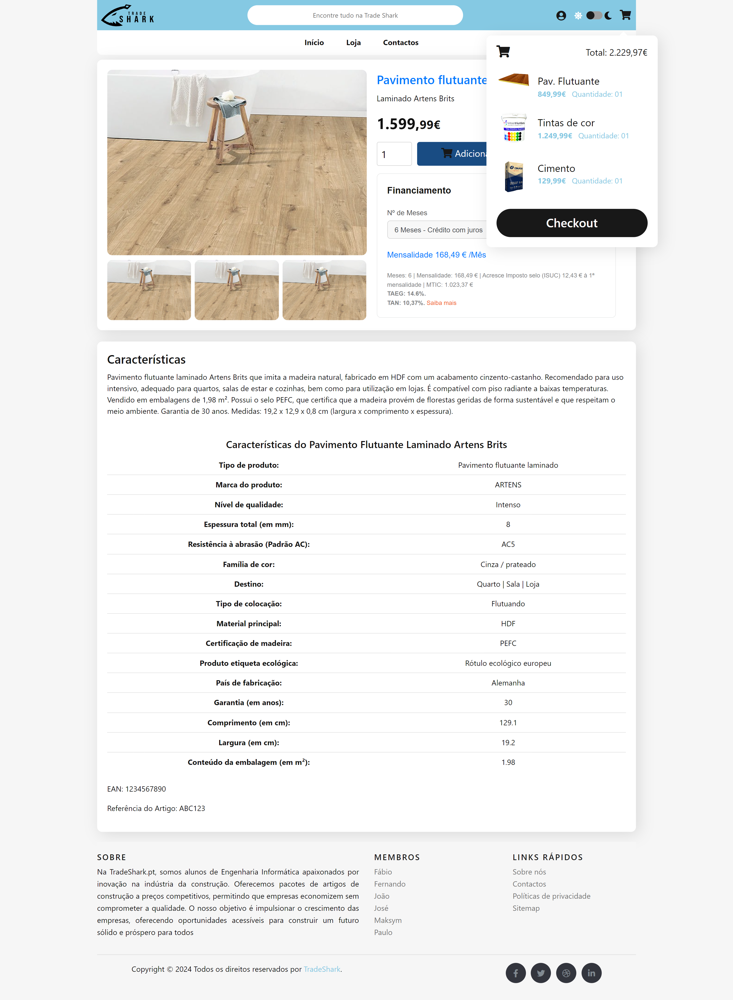
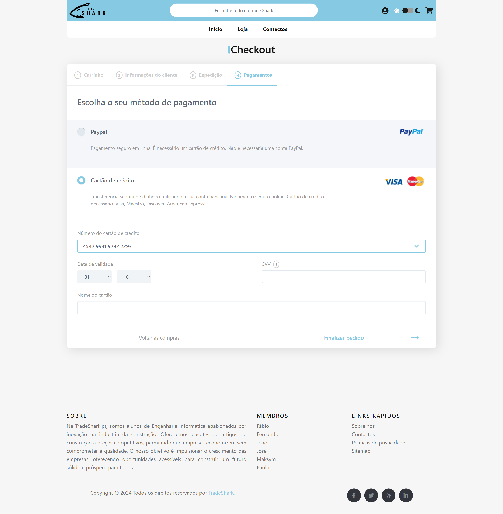
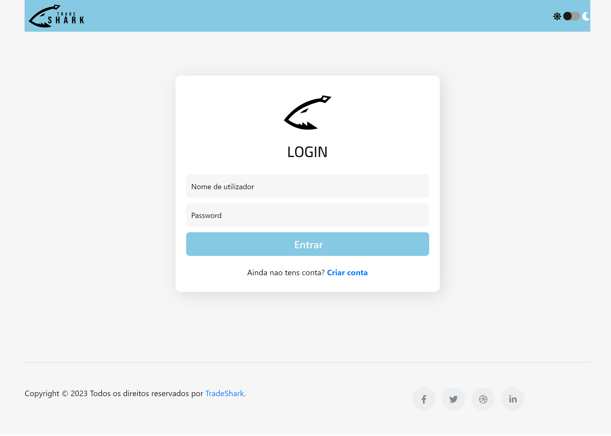
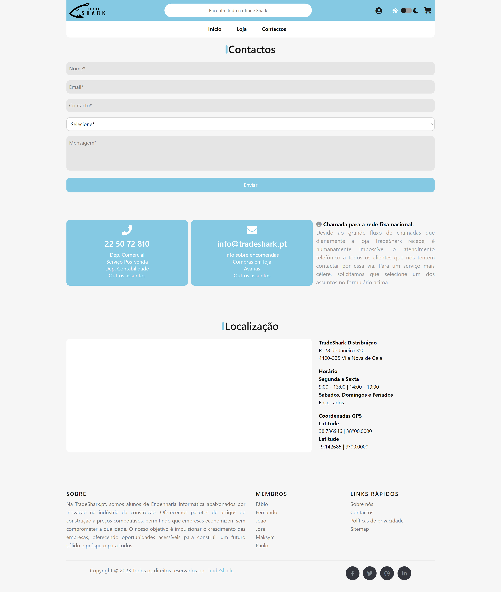

---
# 🦈 TradeShark.pt

Bem-vindo ao **TradeShark.pt**! Este projeto foi desenvolvido como parte de um trabalho académico, com o objetivo de criar uma loja online inovadora voltada para a indústria da construção. A plataforma foi projetada para oferecer pacotes de artigos de construção a preços competitivos, ajudando as empresas a crescerem sem comprometer a qualidade.
---

## 📚 Sobre o Projeto

Na **TradeShark.pt**, somos alunos de Engenharia Informática apaixonados por inovação. O nosso objetivo é facilitar o acesso a materiais de construção a preços acessíveis, permitindo que as empresas economizem enquanto constroem um futuro sólido e próspero. A plataforma conta com funcionalidades como loja online, carrinho de compras, gestão de utilizadores, e muito mais!

---

## 🛠️ Ferramentas e Tecnologias

Aqui estão algumas das tecnologias e ferramentas utilizadas no projeto:

-   
-   
-   
-   

---

## 📈 Funcionalidades

-   **Página de Loja**: Listagem de artigos de construção disponíveis.

    

---

-   **Carrinho de Compras**: Adiciona, remove e faz checkout dos produtos selecionados.

    

---

-   **Página de Checkout**: Processo de compra posterior à adição de artigos ao carrinho.

    

---

-   **Gestão de Utilizadores**: Registo e login de utilizadores com contas personalizadas.

    

      
      
    

---

-   **Modo Escuro/Modo Claro**: Alterna entre modos de visualização para melhor conforto.

    

---

-   **Página de Contactos**: Informação sobre a loja e métodos de contacto.

    

## 🎯 Objetivos do Projeto

-   Oferecer pacotes de **artigos de construção** a preços competitivos.
-   Facilitar a **gestão de compras online** com um **carrinho de compras funcional**.
-   Criar uma **experiência de utilizador fluida** com opções de **login** e **registo**.
-   Proporcionar uma interface **acessível** com suporte para **modo claro e escuro**.

---

## 🔗 Links Úteis

-   [Documentação Oficial do HTML](https://developer.mozilla.org/pt-BR/docs/Web/HTML)
-   [Documentação Oficial do CSS](https://developer.mozilla.org/pt-BR/docs/Web/CSS)
-   [Documentação Oficial do JavaScript](https://developer.mozilla.org/pt-BR/docs/Web/JavaScript)
-   [Documentação Oficial do PHP](https://www.php.net/manual/pt_BR/)

---

## 🛠️ Como Executar o Projeto

1. **Clona o repositório**: `git clone https://github.com/Pelinho03/TradeShark.git`
2. **Configura o ambiente de desenvolvimento** com um servidor local (ex: XAMPP, WAMP).
3. **Coloca os arquivos do projeto** na pasta do servidor local.
4. **Acede ao site** através do navegador: `http://localhost/TradeShark/`.

---

## 🙌 Contribuições

Se tiveres sugestões ou melhorias, sente-te à vontade para abrir uma **issue** ou fazer um **pull request**.

---

## 📅 Atualizações Futuras

-   [ ] Adicionar novos pacotes de produtos.
-   [ ] Melhorar a funcionalidade de pesquisa de produtos.
-   [ ] Implementar um sistema de avaliação de produtos pelos clientes.

---

Feito por [Paulo Guimarães](https://github.com/Pelinho03)

---
